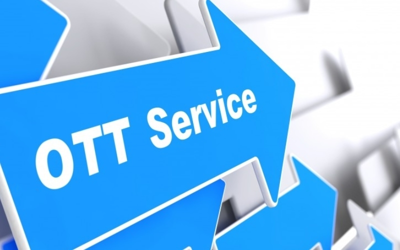
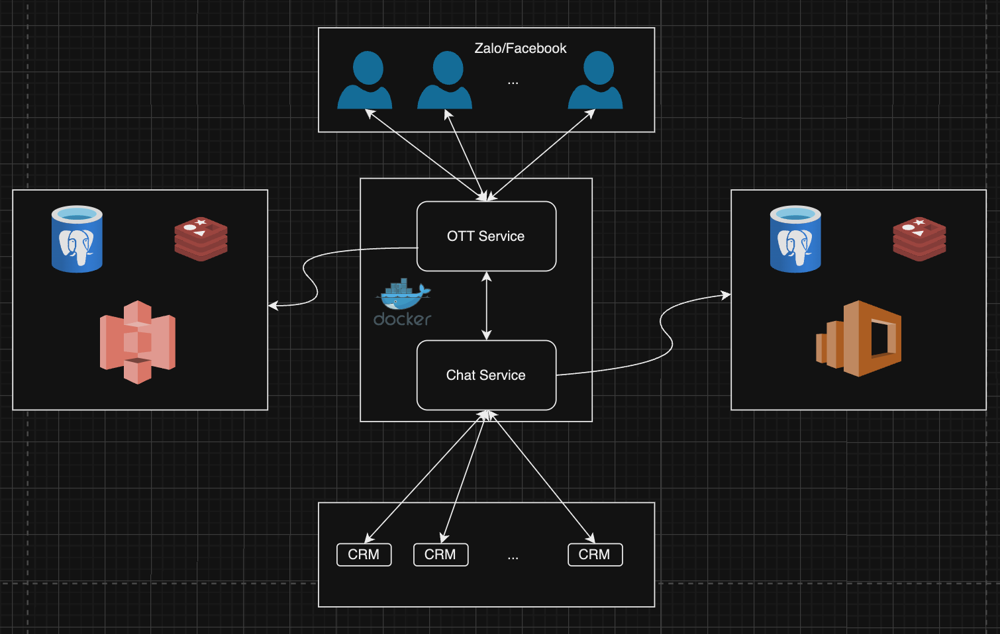
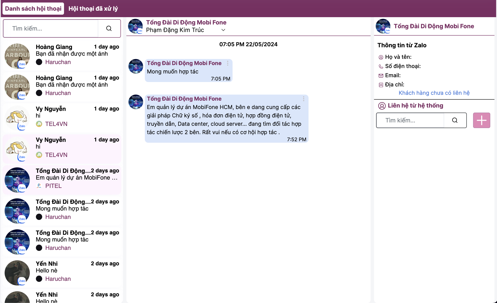

The `main ott service` includes 2 main services: `ott service` and `chat service`.

`ott service` handles requests sent from Facebook/Zalo and is also the final processing location for messages to reach Facebook/Zalo from CRM and CCP (Call Center Pro) systems.

Meanwhile, the `chat service` is where data is received and processed from the ott service, performing storage and pushing information to integrated systems (such as Crm), while also receiving information from integrated systems, then processing it before sending it to the ott service.

Below is the architecture of the main ott service.

