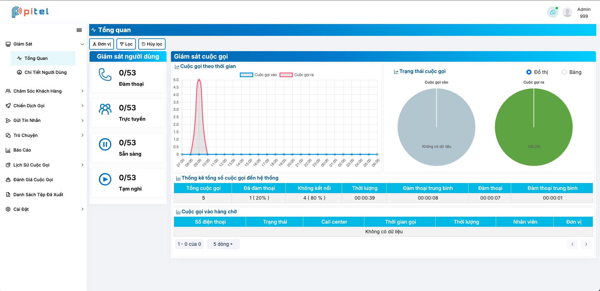
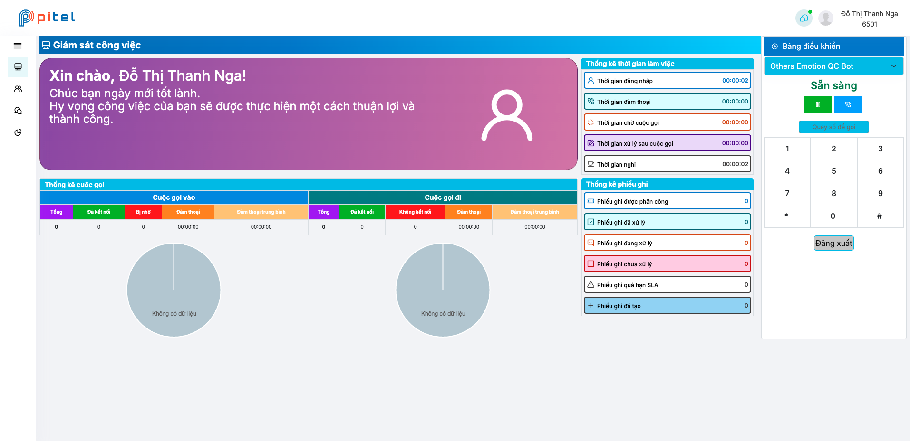
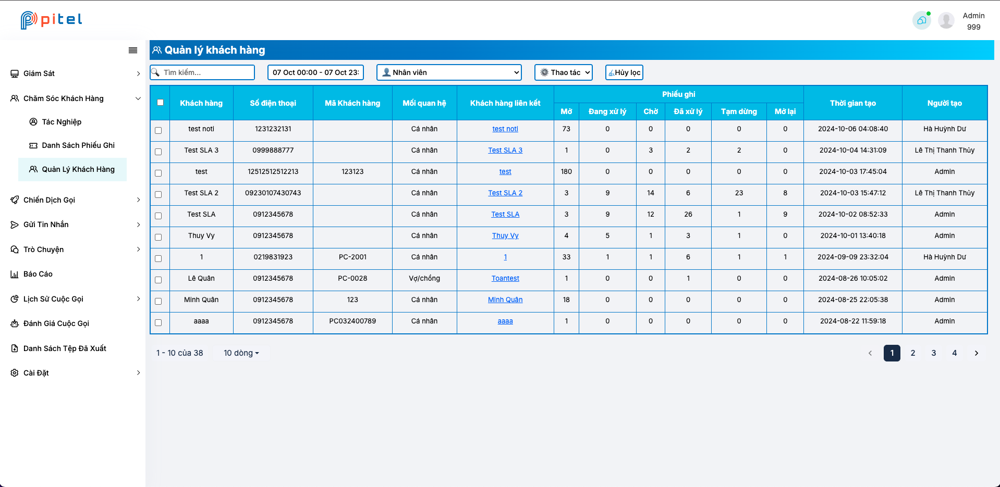
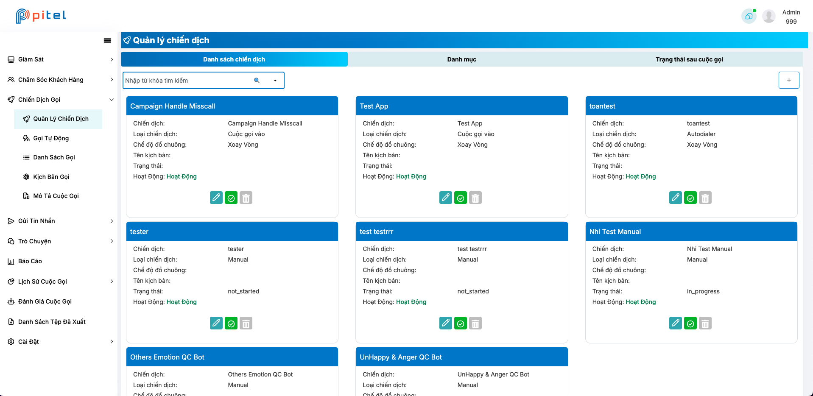
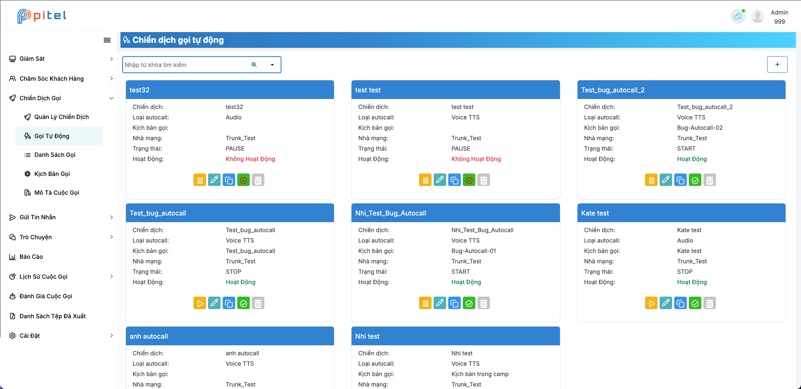
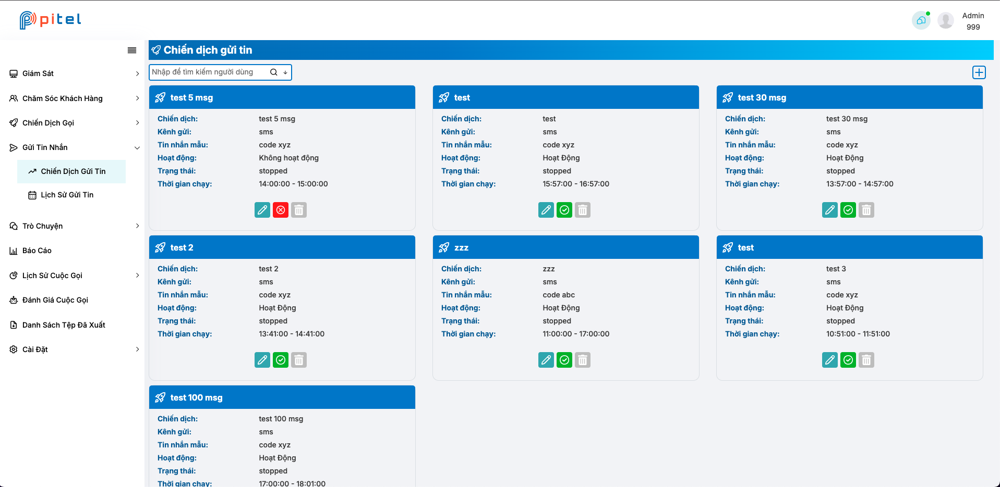
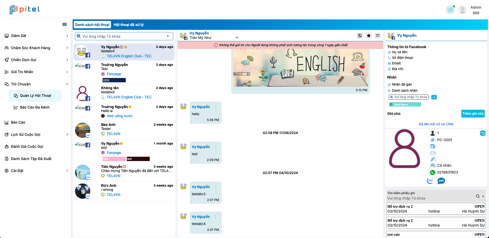
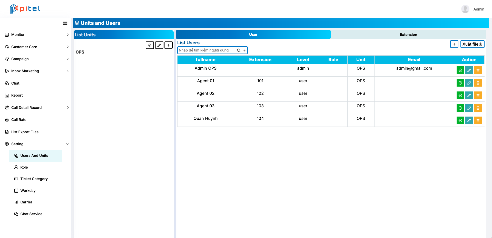

CRM is a customer support product. In addition to connecting call centers for call handling and
multi-channel integration such as [Chat](https://besanh.github.io/anhle_api/blog/chat)chat facebook, zalo, SMS, ZNS and email, it also enables companies to reach,
engage and serve customers in the best possible way.

---
# Dashboard
Admins can easily view and manage the status of users, tickets, contacts, and static calls through the dashboard

# Contact
This screen allows users to manage contacts, tickets, and call detail records (CDRs). Users can easily view, search, create, and edit-all in one screen

# Campaign
Here, users can manage call campaigns and inbox marketing. Each campaign serves a specific purpose, such as increasing engagement with customers via channels like calls, ZNS, SMS

# Chat
Users can interact with customers via channels like Facebook and Zalo, using features such as text chat, media attachments, assigning and reassigning conversations to other users, adding labels, requesting customer information, and searching conversations

# Manage user and unit
With settings for users, units, roles, ticket management, workdays, and chat configuration, users can easily manage all features and data

In conclusion, these are some of the many features in CRM that I can share with you. CRM is still in version 1, with many features to be integrated. I hope to update it soon